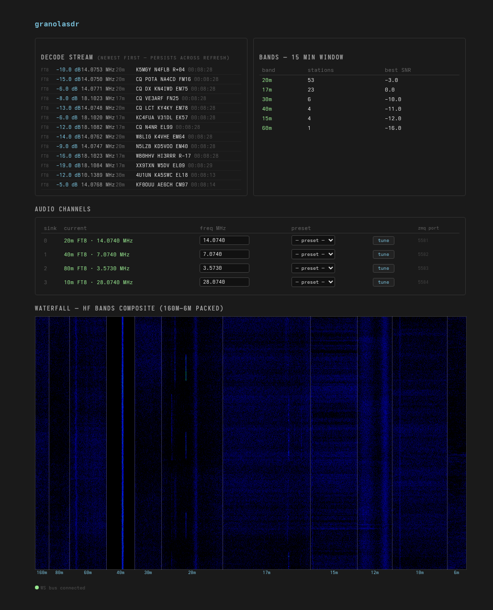

# granolasdr

**[Documentation](https://granolamatt.github.io/granolasdr)**

A wideband HF FT8/JS8 decoder and audio server for the RX888 SDR. Simultaneously monitors all major HF amateur bands (160m–6m) using CUDA-accelerated DSP, uploads decoded stations to [PSKReporter](https://pskreporter.info), and streams 4 tunable 48 kHz virtual radios you can point at any HF frequency.

## How it works

```
RX888 SDR (140 MS/s real, int16_t)
  └─ HFChannelizer (CUDA)
       1,400,000-pt R2C FFT → 100 Hz/bin
       11 HF band slices packed → 2110-bin composite
       SpectrumNorm: asymmetric EMA noise floor + Legendre polynomial equalization
         + cross-band leveling (geometric mean of 11 band centers)
       4096-pt C2C IFFT → 2048 valid complex samples/block @ 409.6 kHz
       Audio: 4 tunable sinks → 480-bin IFFT → 48 kHz ZMQ streams (5581–5584)
         Audio control via wsdict (granolasdr:audio:cmd / granolasdr:audio:status:N)
  └─ MagBlock (CUDA) — normal ring: N=200
       65536-pt FFT (6.25 Hz/bin), 4 time × 4 freq OSR, 160 ms/block
       uint8_t magnitude → DeviceRingBuffer<200> (~200 MB VRAM)
       ├─ WaterfallCuda → wsdict granolasdr:waterfall:N (2048-col RGBA, browser renders)
       ├─ FT8Cuda — continuous Costas scan + soft LLRs
       │    └─ FT8 (CPU): 15s best-SNR window, ZMQ ft8/decode, wsdict ft8:heard:CALL
       └─ JS8Cuda Normal — JS8 Costas scan, 15s/106-block window (--js8)
            └─ JS8 (CPU): per-epoch dedup, ZMQ js8/decode, wsdict js8:heard:CALL
  └─ MagBlock (CUDA) — fast ring: N=100 (--js8-fast)
       40960-pt FFT (10 Hz/bin), 2 time × 2 freq OSR, 100 ms/block
       └─ JS8Cuda Fast → JS8 (CPU): 10s/100-block window
  └─ MagBlock (CUDA) — slow ring: N=100 (--js8-slow)
       131072-pt FFT (3.125 Hz/bin), 2 time × 2 freq OSR, 320 ms/block
       └─ JS8Cuda Slow → JS8 (CPU): 30s/94-block window

ZMQ proxy bus:
  Producers → tcp://*:5599 (XSUB)
  Consumers ← tcp://*:5600 (XPUB)   ← subscribe here for ft8/decode, js8/decode

wsdict WebSocket server (port 8765):
  Browser dashboard — waterfall, decode stream, band table, audio channels panel
  HFChannelizer     — publishes audio:status:N, subscribes audio:cmd for retune

psk_uploader.py (Python):
  Subscribes to :5600, batches ft8/decode + js8/decode, uploads to PSKReporter every 5 min
```

Decoded bands: **160m, 80m, 60m, 40m, 30m, 20m, 17m, 15m, 12m, 10m, 6m**

## Web control UI

Open `http://localhost:8765/` in a browser. The dashboard shows:

- **Decode stream** — newest FT8/JS8 decodes (persists across refresh via wsdict TTL keys)
- **Band summary** — 15-minute station counts and best SNR per band
- **Audio channels** — per-sink current frequency, MHz input, FT8 preset dropdown, and Tune button
- **Waterfall** — scrolling HF composite waterfall (160m–6m packed left-to-right, band labels and separators)

Tune a sink: pick a preset or type a frequency in MHz and press **tune**. The command is sent via WebSocket to `granolasdr:audio:cmd`; the backend applies it and reflects the new frequency back via `granolasdr:audio:status:N`.

## Audio — 4 tunable virtual radios

While `hf_rx` is running it publishes 48 kHz mono audio from 4 independent virtual radios on ZMQ PUB sockets (ports 5581–5584). Each sink is independently tunable to any HF frequency at runtime via the web UI or wsdict.

**Default sink frequencies at startup:**

| Sink | Port | Default | Label |
|------|------|---------|-------|
| 0 | 5581 | 14.074 MHz | 20m FT8 |
| 1 | 5582 | 7.074 MHz | 40m FT8 |
| 2 | 5583 | 3.573 MHz | 80m FT8 |
| 3 | 5584 | 28.074 MHz | 10m FT8 |

### Route audio to PulseAudio

**One-time setup — create virtual sinks:**

```bash
python3 audio_router.py --create-sinks
```

This creates 4 null sinks named `granola-sink0` through `granola-sink3` (displayed as `GranolaSDR-Sink0` etc.). They persist until reboot; to remove them manually use `pactl unload-module`.

**Start routing:**

```bash
python3 audio_router.py
```

Connect to a remote `hf_rx` host:

```bash
python3 audio_router.py --host 192.168.1.x
```

**Listen:**

Open any audio application and select `GranolaSDR-Sink0` as the input device, or use `pavucontrol` to route an existing app. From the command line:

```bash
parec --device=granola-sink0.monitor --rate=48000 --format=float32le --channels=1 \
  | aplay -r 48000 -f FLOAT_LE -c 1
```

### Audio frame format

Published by `hf_rx` on each ZMQ socket, consumed by `audio_router.py`:

| Field | Type | Description |
|-------|------|-------------|
| `sink_id` | uint32 | Sink index 0–3 |
| `seq` | uint32 | Monotonically increasing, wraps at 2³² |
| samples | 240 × float32 | PCM at 48 kHz |

Frame size: 968 bytes. Frame rate: 200 Hz (240 × 200 = 48,000 samples/sec).

## Prerequisites

### Hardware

- [RX888 MkII](https://github.com/TAPR/RX888) or compatible
- NVIDIA GPU with ≥ 4 GB VRAM (tested on RTX 5060 8 GB; `CMAKE_CUDA_ARCHITECTURES` defaults to 120)

### System dependencies

```bash
# Ubuntu/Debian
sudo apt install build-essential cmake libusb-1.0-0-dev libzmq3-dev \
                 python3 python3-pip pulseaudio-utils

# Python packages
pip3 install pyzmq
```

`pulseaudio-utils` provides `pactl` and `pacat`, needed for `audio_router.py`.

### CUDA toolkit

Install the [CUDA Toolkit](https://developer.nvidia.com/cuda-downloads) (CUDA 12+ recommended).
`nvcc` and `libcufft` must be in `/opt/cuda` (the default Arch Linux path).
For other distributions adjust the `include_directories` and `LIBLOC` paths in `CMakeLists.txt`.

### ExtIO_sddc (RX888 driver)

This project requires a specific fork of ExtIO_sddc that provides the `sddc` shared library:

```bash
git clone https://github.com/granolamatt/ExtIO_sddc
cd ExtIO_sddc
mkdir build && cd build
cmake ..
make -j$(nproc)
sudo make install
```

The build installs `libsddc.so`. If it lands somewhere other than a standard library path, set `LD_LIBRARY_PATH` accordingly.

### ft8_lib

The `ft8_lib/` directory contains a modified copy of [kgoba/ft8_lib](https://github.com/kgoba/ft8_lib) with granolasdr-specific changes:
- `ftx_find_candidates_range()` for parallel frequency-sliced candidate search
- `int32_t` offsets in `ftx_candidate_t` for wider waterfalls
- `monitor.c` stripped to `monitor_reset()` (GPU handles FFT/windowing)

A prebuilt `ft8_lib/libft8.a` is included. To rebuild from source:

```bash
cd ft8_lib
make
```

## Build

```bash
git clone https://github.com/granolamatt/granolasdr
cd granolasdr
mkdir build && cd build
cmake ..
make -j$(nproc)
```

The main binary is `build/hf_rx`.

To target a specific GPU architecture (e.g. Ada Lovelace / sm_89):

```bash
cmake -DCMAKE_CUDA_ARCHITECTURES=89 ..
```

## Running

### Start the decoder

```bash
./build/hf_rx
```

This starts the RX888 capture, CUDA processing pipeline, FT8/JS8 decoders, and wsdict server.
Open `http://localhost:8765/` for the live dashboard.

Decoded messages are printed to stdout:

```
DECODED: W1AW K1ABC FN42 time_offset=0.450s freq=14074150.3Hz snr=-8.0 unix=1716000015
```

A ZMQ proxy opens on port 5599 (producers) and 5600 (consumers). Subscribe to port 5600 with topic prefix `ft8/decode` or `js8/decode` to receive decoded messages as JSON:

```json
{"call":"K1ABC","freq":14074150,"snr":-8.0,"unix":1716000015,"offset":0.45}
```

**`hf_rx` flags:**

| Flag | Default | Description |
|------|---------|-------------|
| `--js8` | off | Enable JS8 Normal mode decoder (15s, 6.25 Hz/bin) |
| `--js8-fast` | off | Enable JS8 Fast mode decoder (10s, 10 Hz/bin) |
| `--js8-slow` | off | Enable JS8 Slow mode decoder (30s, 3.125 Hz/bin) |
| `--max-log-costas` | off | Use max-log 8-FSK Costas metric instead of the default legacy frequency+neighbor |
| `--min-score FLOAT` | `5.0` | Minimum Costas sync scan score threshold (`3.0` with `--max-log-costas`) |
| `--wf-floor UINT8` | `170` | Waterfall lower clamp (raise to darken noise floor) |
| `--wf-ceil UINT8` | `210` | Waterfall upper clamp (lower to saturate signals sooner) |
| `--record FILE` | off | Record channelizer output to a `.dat` file for later playback |
| `--playback FILE` | off | Replay a `.dat` file instead of using a live RX888 |
| `--waterfall-center-hz FLOAT` | `105500` | Composite waterfall center frequency (Hz) |
| `--waterfall-bw-hz FLOAT` | `211000` | Composite waterfall bandwidth (Hz) |
| `--zoom-band START END` | off | Zoom waterfall to band index range (0=160m … 10=6m) |

### Upload to PSKReporter

```bash
python3 psk_uploader.py --call W1AW --grid DM78
```

| Option | Default | Description |
|--------|---------|-------------|
| `--call` | required | Your callsign (receiver) |
| `--grid` | required | Your Maidenhead grid square |
| `--rig` | `rx888` | Antenna/rig description |
| `--xpub` | `5600` | ZMQ XPUB proxy port (consumers subscribe here) |
| `--interval` | `300` | Upload interval in seconds |
| `--test` | off | Send to PSKReporter packet analyzer (port 14739) |
| `--send-test-packet` | off | Send one dummy packet and exit |

Uploads are batched every 5 minutes as required by PSKReporter.
Verify your reports appeared: https://pskreporter.info/pskmap.html

## Python tools

Install dependencies:

```bash
pip3 install -r requirements.txt
```

### `audio_router.py`

Routes the 4 tunable 48 kHz ZMQ audio streams into PulseAudio null sinks. See [Audio — 4 tunable virtual radios](#audio--4-tunable-virtual-radios) above.

### `psk_uploader.py`

Subscribes to the ZMQ XPUB socket and batches decoded messages into PSKReporter IPFIX UDP packets.

### `check_uploads.py`

Queries PSKReporter to confirm your reports were accepted:

```bash
python3 check_uploads.py --call W1AW --period 1800
```

### `compare_psk.py`

Compares your decoder output against what PSKReporter stations near you heard, to measure missed signals:

```bash
python3 compare_psk.py messages.txt --grid DM78 --max-dist 1500
```

### `compare_corpus.py` — JTDX / WSJT-X comparison

Record a session with `--record`, then replay it and simultaneously run JTDX or WSJT-X on the same signal:

```bash
# 1. Record
./build/hf_rx --record /tmp/session.dat

# 2. Replay and decode with WSJT-X reference
for f in ft8_corpus/*.wav; do
    jt9 --ft8 -d 3 "$f" >> ALL.TXT
done

# 3. Compare
python3 compare_corpus.py granola_log.jsonl ALL.TXT --date 20240518
```

## Network ports

| Port | Protocol | Direction | Description |
|------|----------|-----------|-------------|
| 5599 | ZMQ XSUB | inbound | ZMQ proxy — producers (FT8, JS8) connect here |
| 5600 | ZMQ XPUB | outbound | ZMQ proxy — subscribers connect here; topics: `ft8/decode`, `js8/decode` |
| 5581 | ZMQ PUB | outbound | Audio sink 0 (48 kHz PCM) |
| 5582 | ZMQ PUB | outbound | Audio sink 1 (48 kHz PCM) |
| 5583 | ZMQ PUB | outbound | Audio sink 2 (48 kHz PCM) |
| 5584 | ZMQ PUB | outbound | Audio sink 3 (48 kHz PCM) |
| 8765 | WebSocket | inbound | wsdict server — browser dashboard + audio control |

## Project structure

```
gm/
  cuda/
    HFChannelizer.cc      — CUDA channelizer: R2C FFT → 11-band composite → SpectrumNorm → IFFT + 4 audio sinks
    SpectrumNorm.cu/.h    — Per-band Legendre polynomial noise-floor equalization (asymmetric EMA + cross-band leveling)
    MagBlock.cc           — Oversampled C2C FFT → uint8 magnitude → DeviceRingBuffer; feeds FT8/JS8/Waterfall
    WaterfallCuda.cc      — Reads MagBlock ring; publishes RGBA rows to wsdict (granolasdr:waterfall:N)
    FT8Cuda.cc            — Continuous Costas scan + soft LLRs; decode callback → FT8
    JS8Cuda.cc            — JS8 Costas scan + soft LLRs; decode callback → JS8 (Normal/Fast/Slow)
    FT8ScanCuda.cu        — GPU Costas sync scan kernel; outputs candidate list
    FT8SoftCuda.cu        — GPU soft symbol kernel; outputs float32 LLRs per candidate
    HostCuda.cu           — CUDA kernels (int16→float cast, frequency shift)
  hf/
    ft8.cc                — FT8 15s window decoder; ZMQ ft8/decode publisher; wsdict ft8:heard:CALL
    js8.cc                — JS8 epoch decoder (Normal/Fast/Slow); ZMQ js8/decode publisher
    hf_bands.h            — Single source of truth: 11-band wideband FFT bin table
  buffer/
    BufferFile.cc/h       — Generic pipeline tape; record or replay any BufferPosition<T> edge
  rx888/                  — RX888 USB driver interface
  zmqcode/                — ZMQ pub/server utilities
ft8_lib/                  — FT8/JS8 codec (prebuilt libft8.a)
wsserver/                 — Rust WebSocket dict server (wsdict); vendored as static library
wsdict.h                  — C++ header-only WsDictClient: set/get/subscribe/del
wsdict_server.h           — C shim: wsdict_server_start() to launch the Rust wsserver
control/index.html        — Browser dashboard: decode stream, bands, audio channels, waterfall
third_party/              — Vendored single-header libs: nlohmann/json
audio_router.py           — Route 4-sink 48 kHz ZMQ audio streams to PulseAudio null sinks
psk_uploader.py           — PSKReporter IPFIX uploader (subscribes to ZMQ XPUB :5600)
compare_psk.py            — Decoder vs PSKReporter comparison tool
compare_corpus.py         — granolasdr vs JTDX/WSJT-X decode comparison
check_uploads.py          — Verify PSKReporter accepted your uploads
```

## License

MIT — see [LICENSE](LICENSE). Includes [ft8_lib](ft8_lib/LICENSE) by Kārlis Goba, also MIT.

---


